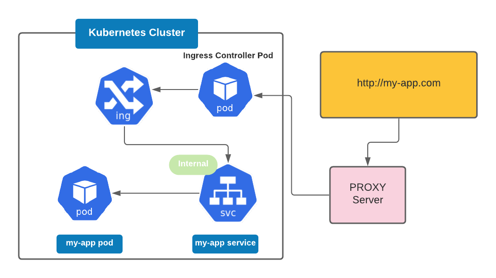

# kubernetes-ingress
Build dashboard interface with ingress

## External Service vs. Ingress

ingress component

What is Ingress Controller ?
- Third party component.
- Evaluates all the rules
- manages redirections
- entrypoint to cluster



k8s Nginx Ingress Controller

Install ingress controller

minikube addons enable ingress
```commandline
minikube addons enable ingress
🌟  The 'ingress' addon is enabled
```

Automatically starts the K8s Nginx implementation of Ingress Controller


```commandline
kubectl get pod -n kube-system
ingress-nginx-controller-xxxxxx-xxxxxx   1/1     Running     0          2m31s
```

sudo vim /ect/hosts
add the ipaddress 

